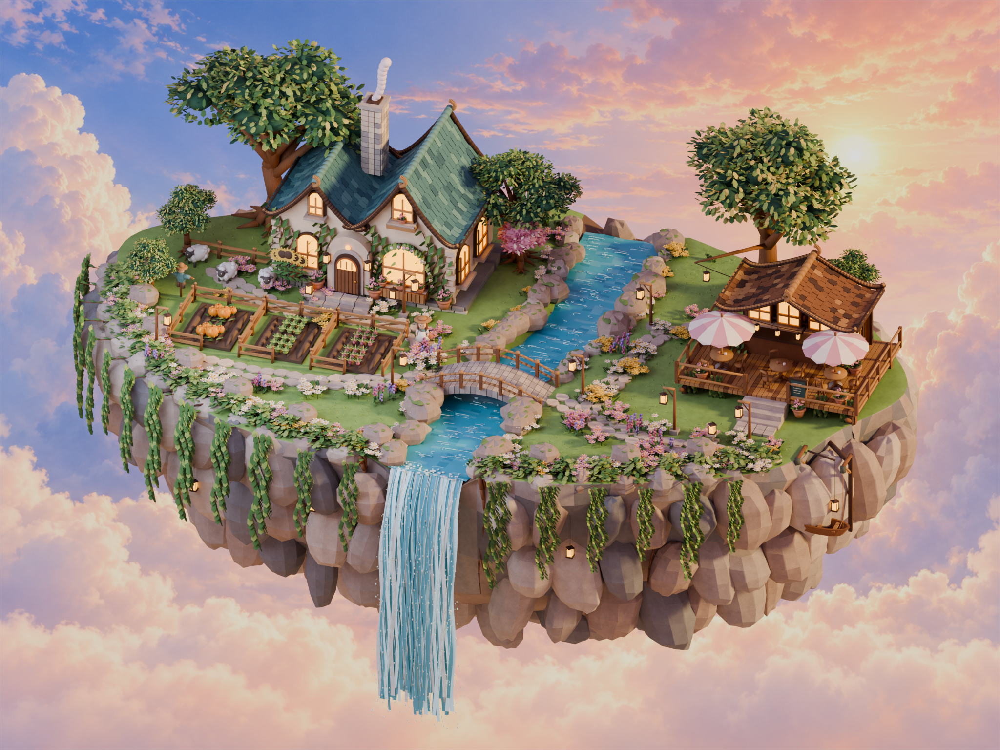

# 暮光浮岛 · Dusk Island

根据黄昏参考图制作的可编辑 Blender 场景。本轮对建筑、植被、岛体、水体、材质、灯光与镜头进行了第二次精修。网页查看器默认加载精修版，上一版文件保留。



## 打开结果

- **Blender 编辑**：`island_dusk_refined.blend`，保留独立对象、分类集合、材质、灯光、主相机与已打包背景图。
- **网页查看**：双击 `start_viewer.command`，或运行 `python3 -m http.server 8765 --bind 127.0.0.1`，打开 [三维查看器](http://127.0.0.1:8765/viewer/)。
- **参考图对照**：[对照页](http://127.0.0.1:8765/renders/refined/comparison.html)，包含原参考图、本轮渲染、上一版渲染和细节镜头；本地文件为 `renders/refined/comparison.html`。
- **导入其他引擎**：`island_dusk_refined.glb`，贴图内嵌，标准 Y 向上坐标。导入器需支持 `KHR_mesh_quantization`。

查看器支持拖动旋转、滚轮缩放、右键平移，按钮或数字键 1–4 切换全岛、小屋、咖啡馆和俯视镜头。

## 本轮改动

- 小屋改为高低错落的双山墙、弧形瓦檐和逐片叠瓦；补充四面烟囱石块、木门、窗箱与攀爬花藤。
- 咖啡馆采用暖木瓦屋顶、暖光后窗，重新连接台阶和花园小径；树木放在屋后，灯串由枝干支撑。
- 大树重做枝干、宽冠和折叠叶片；岛缘增加混合花丛、薰衣草、草叶、根系与不规则垂藤。
- 岩体加深并打散重复石块，增加表面纹理、岩缝和悬挂灯笼。
- 溪流与瀑布重做涟漪、细流、泡沫与水滴；网页减面时保留水体细节。
- 增加草帽女孩和小猫静态摆件；采用 4:3 正交主镜头，调整黄昏主光和补光。
- 添加 18 张 256×256 程序材质贴图。天空为独立生成的二维黄昏云海背景，使用内置 image_gen；提示词和用途记录在 `assets/textures/README.md`。

## 交付结构

| 路径 | 内容 |
| --- | --- |
| `island_dusk_refined.blend` | 完整可编辑精修场景 |
| `island_dusk_refined.glb` | 减面、压缩后的网页场景 |
| `assets/refined/source/`、`assets/refined/glb/` | 11 个重做组件的独立 Blender / GLB 文件 |
| `assets/textures/` | 材质贴图、云海背景及生成说明 |
| `renders/refined/island_dusk_refined.png` | 2048×1536、Cycles 96 采样主视角 |
| `renders/refined/house_detail.png` | 小屋细节渲染 |
| `renders/refined/cafe_detail.png` | 咖啡馆细节渲染 |
| `renders/refined/layout_top.png` | 布局俯视渲染 |
| `reports/refined_scene.json` | 实际几何、体积、贴图和机位数据 |
| `reports/refined_validation.json` | 精修主场景及独立组件的 glTF 校验汇总 |
| `scripts/refine.py`、`scripts/refined_assets.py` | 固定随机种子的 Blender 精修脚本 |
| `scripts/optimize_glb.cjs` | 压缩法线、去除无用 UV，保留顶点位置和拓扑 |
| `island_dusk.blend`、`island_dusk.glb` | 上一版本，仍可打开 |
| `reference/baseline_readme.md` | 上一版本的说明和验收数据 |

## 质量与边界

精修 Blender 场景约 **96.3 万三角面**，保留完整叶片和表面细节，超过首版的 60 万面预算。网页版本单独优化到 **约 56.9 万三角面、24 MB**，满足原先的网页体积与面数目标；最终精确数值以报告为准。

小岛及其可旋转内容均为真实三维几何。天空是二维合成背景，没有烘成岛屿模型。GLB 保留颜色纹理，Blender 中的微表面凹凸和合成光晕不完全等同于网页渲染。

本轮是参考图导向的精修，**并未达到逐像素一致**。建筑形态、树冠与花园布局、水体材质等仍有可见差异；对照页直接展示差距。本机浏览器检查中的帧率仅代表本机当时的状态，不构成其他设备的性能保证。

## 重现

需要本地 Blender 5.2 和 Node.js。在项目根目录执行：

```sh
# 快速预览，保留现有正式交付
/Applications/Blender.app/Contents/MacOS/Blender -b --python scripts/refine.py -- --width 1100 --samples 24

# 完整精修、组件导出、网页压缩与四个正式渲染镜头
/Applications/Blender.app/Contents/MacOS/Blender -b --python scripts/refine.py -- --width 2048 --samples 96 --export
```

精修脚本以根目录的 `island_dusk.blend` 为基础，每次从上一版重新开始，避免多次累积修改。正式流程自动调用 `scripts/optimize_glb.cjs`。默认使用本机 Metal GPU。

原有首版建模流程仍在 `scripts/build.py`、`scripts/assets.py` 与 `scripts/assemble.py` 中；运行它们会重建首版，而不是精修版。
