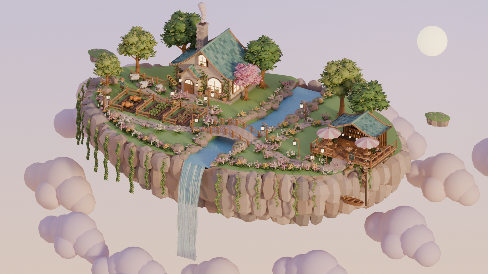

# 暮光浮岛 · Dusk Island

基于黄昏版需求文档与参考图制作的静态 3D 场景。使用 Blender 5.2.1 本地建模与 Cycles 渲染，包含小屋、农田、溪流瀑布、石拱桥、咖啡馆、植被、云海和悬吊小船。



## 打开场景

- **Blender 编辑**：打开根目录 `island_dusk.blend`。已保存完整的独立物件、分类集合、材质、灯光、天空合成器和验收相机。
- **网页查看**：双击 `start_viewer.command`，或在项目根目录运行 `python3 -m http.server 8765 --bind 127.0.0.1`，再打开 <http://127.0.0.1:8765/viewer/>。如果服务器已经运行，直接打开网址。
- **导入其他引擎**：使用根目录 `island_dusk.glb`。材质自包含，无外部贴图或 CDN 依赖。

查看器支持拖动旋转、滚轮缩放、右键平移；四个按钮或数字键 1–4 分别切换整岛、小屋、咖啡馆与俯视镜头。模型、水体和人物均为静态。

## 交付内容

| 路径 | 内容 |
| --- | --- |
| `island_dusk.blend` | 可编辑的完整场景，按地形、建筑、农田、树木、花园、小径、水体、云海、细节分组 |
| `island_dusk.glb` | 按材质合并的网页展示版本 |
| `assets/source/` | 36 个独立 `.blend` 资产，附各自的预览相机与灯光 |
| `assets/glb/` | 36 个独立 `.glb` 资产，仅包含资产网格 |
| `assets/previews/` | 每件资产的真实 Blender 渲染预览 |
| `renders/island_dusk_2048.png` | 2048×1152 南向北斜俯视验收图 |
| `renders/house_detail.png` | 小屋细节镜头 |
| `renders/cafe_detail.png` | 咖啡馆细节镜头 |
| `renders/layout_top.png` | 整岛布局俯视图 |
| `renders/asset_catalog.jpg` | 全部资产预览总览 |
| `reports/` | 面数、文件大小、资产规格与 glTF 规范验证结果 |
| `scripts/` | 可重现建模、拼装与验证的源代码 |
| `reference/` | 用户提供的需求文档和参考图副本 |
| `viewer/` | 本地 Three.js 0.186.0 查看器及依赖、MIT 许可证 |

## 规格与实现

- Blender 中 **1 单位 = 1 米**，Z 向上，资产正面朝 -Y，原点位于物件底部中心。glTF 导出时转换为标准 Y 向上，原 Blender -Y 朝向对应 glTF +Z。
- 草地台地长短轴约 45×28 米；凸出岩块使整体外轮廓约为 48×30 米。岩体向下收尖，整体高度约 11.4 米。
- 小屋门板约 2 米；主层约 3.2 米；比例参照物 1.4 米。烟囱与屋顶计入建筑总高度。
- 材质使用 PBR Base Color、Roughness 与灯火 Emission，无资产贴图。瀑布使用 Alpha Blend，水面与泡沫由静态几何组成。
- 六棵大树、一棵花树；花丛、叶片与藤蔓使用复用面片组件。没有动画、角色控制或游戏逻辑。
- 桥从两岸实地跨越河道，溪流通过桥洞；台阶连接入口与小径；灯笼挂在杆、屋檐或连续绳索上；小船使用双挑架、滑轮、吊绳和连接岛岸的支撑梁。
- 咖啡馆东侧露台挑出岛缘，背部和西侧支撑落在岛岸，正面台阶连接岸上小径。
- 完整 `.blend` 保留可编辑实例；合并 `.glb` 以较少的绘制批次适配网页。天空渐变、太阳方向光和柔和补光由渲染场景或查看器设置；glTF 本身不携带 Blender 合成器。

## 验收与限制

最终数值见 `reports/scene_report.json` 和 `reports/acceptance.md`。整岛约 29 万三角面、GLB 约 11.4 MB；Khronos 验证器检查结果在 `reports/all_glb_validation.json`。

在本机 Codex 内置浏览器中检查了场景加载、镜头切换、旋转与缩放。帧率记录仅代表本机测试环境，其他设备表现会随显卡、分辨率和浏览器变化。

这是根据参考插画主动简化的风格化场景：采用程序几何、简化 PBR 材质和较低植被密度，未逐像素复刻插画的材质与云层细节。Tripo CLI 检查发现未登录，且设备授权服务无法连接；因此本轮资产均由本地 Blender 完成，**未提交 Tripo 生成任务、未消费 Tripo 积分**。

## 重新生成

在项目根目录执行：

```sh
/Applications/Blender.app/Contents/MacOS/Blender -b --python scripts/build.py -- --asset all
/Applications/Blender.app/Contents/MacOS/Blender -b --python scripts/build.py -- --assemble
```

也可以单独重建一个组件，例如 `--asset house_main`。若资产改动需要出现在整岛中，随后再次执行 `--assemble`。源脚本使用固定随机种子以便复现。渲染默认使用本机 Metal GPU。

独立资产 `.blend` 内的 `preview_ground`、相机和灯光仅服务预览；资产对象名称与文件名相同，独立 GLB 导出只选择该对象。
