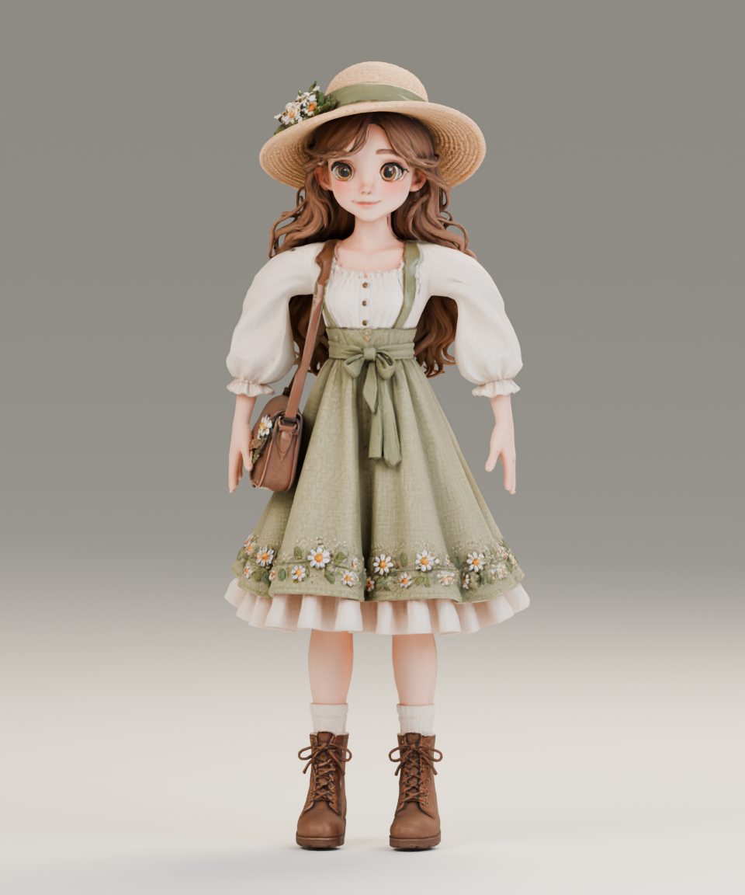

# 雏菊 · Tripo 精细人物

按 `reference/character/original.png` 的造型，以整理后的 `front_t_pose.png` 为 Tripo 输入，生成草帽、卷发、奶油色泡泡袖、绿色雏菊裙、挎包和靴子。使用 Tripo 生成几何、4K PBR 纹理和初始骨架，再用本机 Blender 5.2.1 处理游戏版本。不是逐像素复刻，也不是完整影视级角色。

打开 [人物工作室](http://127.0.0.1:8765/viewer/character.html) 查看五段动作、面部与背面；「初版对照」保留此前本地制作的角色。[动态小岛](http://127.0.0.1:8765/viewer/) 默认使用本版。



## 文件与规格

| 路径（相对本目录） | 用途 |
| --- | --- |
| `source/daisy_tripo_source.blend` | 高精度静态原模，1,894,963 三角面，打包 4K 纹理 |
| `runtime/daisy_tripo.blend` | 可编辑可动版，含骨架、蒙皮、五段动作和渲染灯光 |
| `runtime/daisy_tripo.glb` | 网页默认角色，154,379 三角面（包含浇水壶），约 13.0 MB |
| `tripo-out/daisy-detailed-a7bd67e9/` | 原始生成 GLB、预览和任务参数，保留不覆盖 |
| `tripo-out/daisy-rigged-3dbebed3/` | 服务返回的原始绑定模型和任务记录 |
| `tripo-out/rig-check-b684ae59/` | 免费可绑定性检查记录 |

游戏版本保留 base color、ORM、normal 三张 4096×4096 贴图；骨架共 37 根，最多每顶点 4 个权重。导出的五段动画为 `Idle`、`Walk`、`Plant`、`Water`、`Harvest`，朝向 Three.js +Z，静止身高约 1.86。

生成时请求了 Mixamo 规格，但服务实际返回自定义命名的 28 骨骨架。本地脚本按骨骼位置映射身体关节，校正髋膝位置，并补充头发、包、裙摆控制。裙摆与腿部按下缘网格连通关系分离权重；UV 接缝只用于判断连通，纹理与网格保留。头部、发束和挎包也做了局部权重调整。

五段动画在本地 Blender 制作；浇水壶沿用本地初版并绑定到手。网页只在浇水时显示壶。Blender 源文件默认待机，预览浇水时需要打开 `Watering_Can` 的渲染可见性。

## 费用

只生成一份角色，无付费重抽：精细几何与精细纹理生成 60 积分，绑定检查 0，骨架绑定 25，总计 **85 积分**。2026-09-17 核对余额 **515**、冻结 **0**。本地减面、蒙皮修正、动画与导出不消耗 Tripo 积分。

## 后续精修边界

当前适合小岛游戏视角与造型评审。眼睑、嘴部和手部仍有生成网格的痕迹；没有表情形态键、独立手指骨架或精确握壶动作。长裙采用骨骼摆动，没有布料模拟；步态没有足部 IK，可能出现轻微滑步或衣物交叠。自动减面不等于人工四边面拓扑；手机场景与大量同屏角色还需要 LOD 和纹理压缩。

下一轮建议先精修眼睛、嘴部、手型与步态，再加眨眼、表情和交互细节。高模已保留，无需重新花积分生成。

## 本地重现

在项目根目录运行（使用已经保存的绑定 GLB，不调用 Tripo）：

```sh
/Applications/Blender.app/Contents/MacOS/Blender -b --python scripts/prepare_tripo_character.py
node scripts/validate_character.cjs --tripo
node scripts/test_living.mjs
```

验证脚本需要 `gltf-validator`，也可通过 `GLTF_VALIDATOR_MODULE` 指定已有安装位置。规格和校验结果位于 `reports/tripo_character_*.json`，验收说明见 `reports/tripo_character_acceptance.md`。
